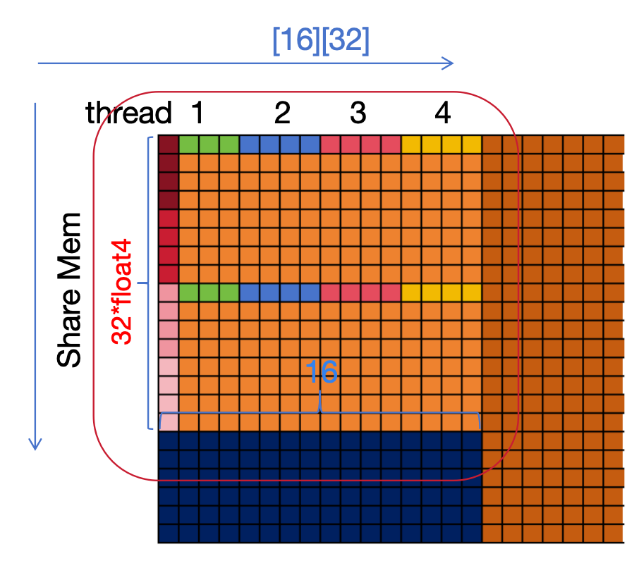

# aduc
.........

平台及环境: 
- Tesla P4 8G 
	- SM : 20
	- FP32 CORE PER SM : 128
- CUDA Version: 12.2

[profile](https://wenqingqian.github.io/assets/html/resource/assets/aduc.html)

## (v2)gemmTile

一个线程负责计算红色区域的数据

## (v3)gemmShareMem

共享内存IO:
- 线程排布: 
	- A: 行优先
	- B: 列优先
- 内存排布:
	- A: 行优先
	- B: 行优先

读取数据到共享内存时:(一个线程跨步同时处理4个float4, AB各两个)

A

B

计算时:

一个线程计算 8x8 的数据, 这些数据是分散的需要映射到矩阵C上

计算时和读取内存到共享内存时线程排布不一致, 计算时类似v2, 增加了计算强度

## (v3)gemmShareMemECG1

共享内存IO:
- 线程排布: 
	- A: 行优先
	- B: 行优先
- 内存排布:
	- A: 行优先
	- B: 行优先

[blog](https://zhuanlan.zhihu.com/p/531498210)中对于读取B到共享内存是把B沿行方向分成两部分, 按行优先排布线程

实测速度在Tesla P4上会慢10%PF左右, 在nsys report中看到寄存器使用量从128增加到了143

## (v3)gemmShareMemECG2

共享内存IO:
- 线程排布: 
	- A: 行优先
	- B: 列优先 
- 内存排布:
	- A: 列优先
	- B: 行优先

对于A中的数据, 在计算时线程是按照列优先进行读取, 而存入时因为float4是按行优先存取的, 这个过程需要单独对每个float4进行构造, 在基准V3中是按行优先直接存入SMem, 读取时构造成列fragment, 此对照组在存入SMem时按列存入即在存入过程中进行列构造, 读取时直接得到float4

增加4%左右

---

reference:

1. OpenMLSys
	- [blog](https://zhuanlan.zhihu.com/p/531498210)
	- [github](https://github.com/openmlsys/openmlsys-cuda/tree/main)