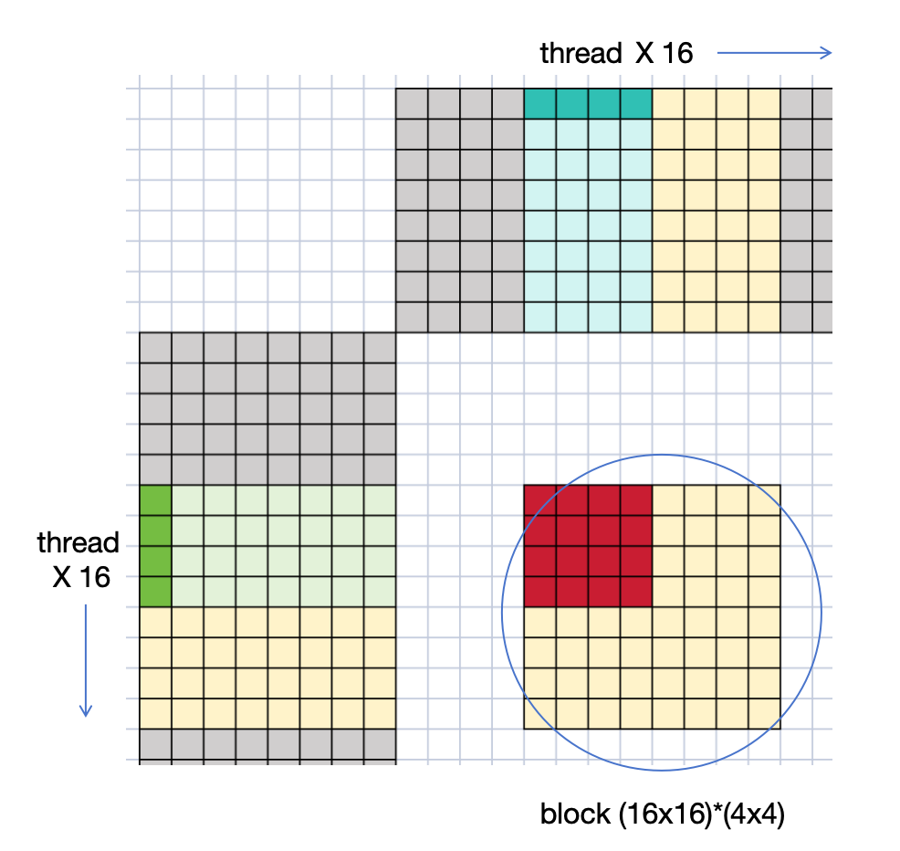
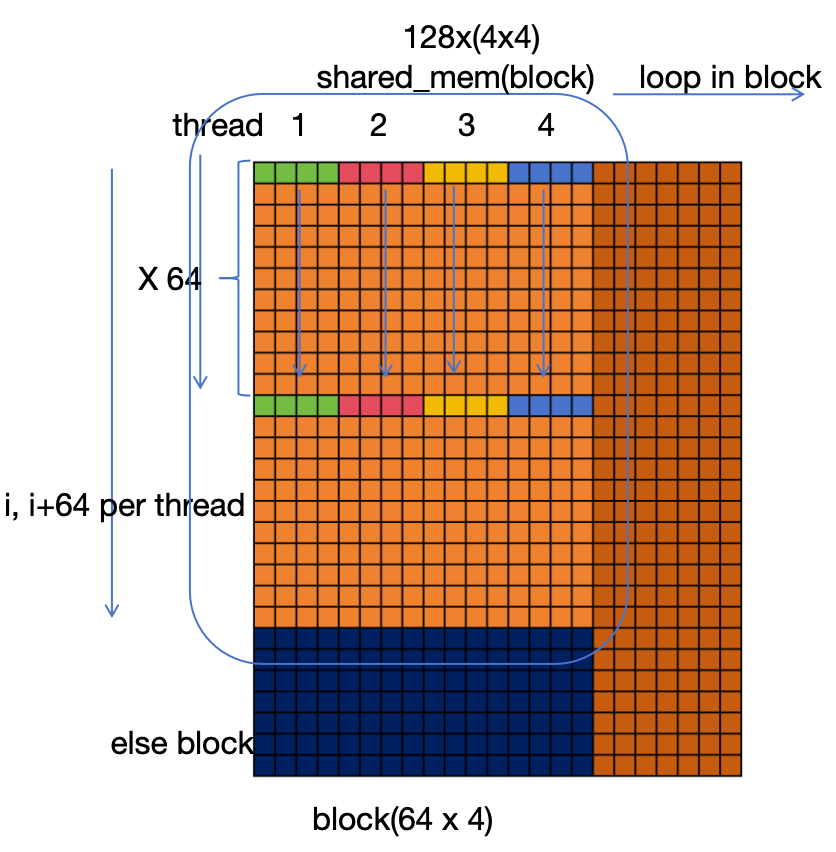
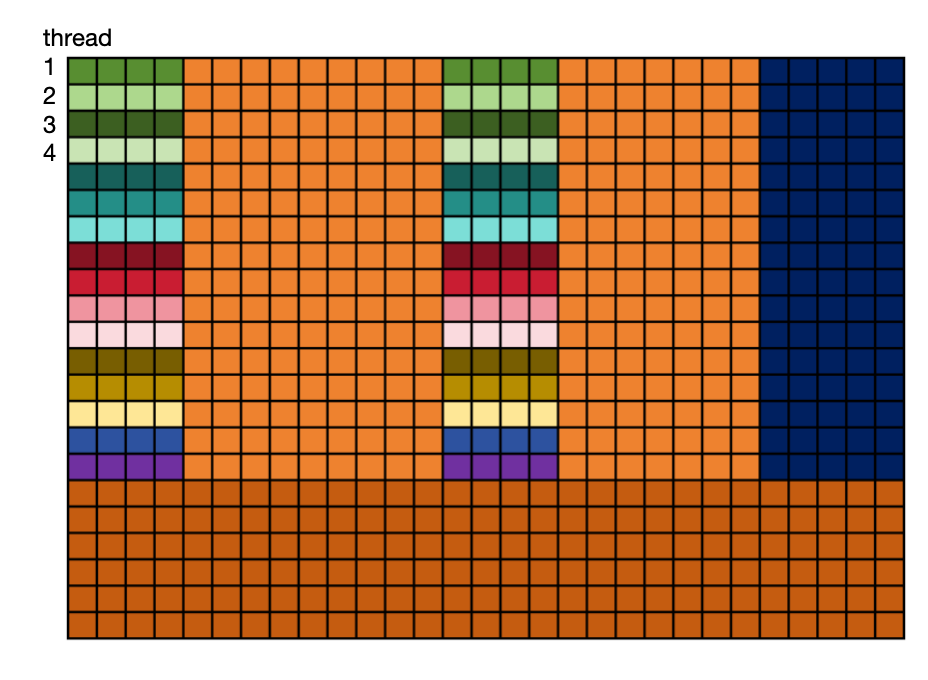
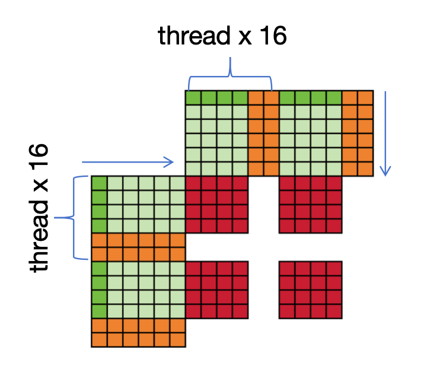
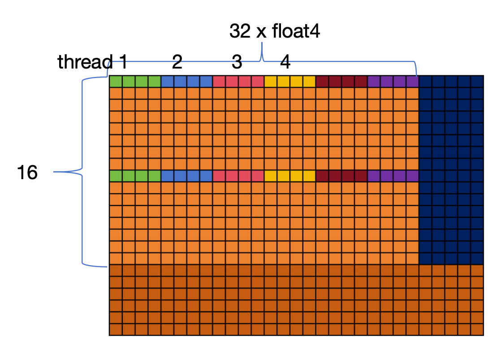

1. (v2)gemmTile

一个线程负责计算红色区域的数据

2. (v3)gemmShareMem

读取数据到共享内存时:(一个线程跨步同时处理4个float4, AB各两个)

A

B

计算时:

一个线程计算 8x8 的数据, 这些数据是分散的需要映射到矩阵C上

计算时和读取内存到共享内存时线程排布不一致, 计算时类似v2, 增加了计算强度

3. (v3)gemmShareMemECG

[blog](https://zhuanlan.zhihu.com/p/531498210)中对于读取B到共享内存是把B沿行方向剪开

实测速度会慢13%PF
