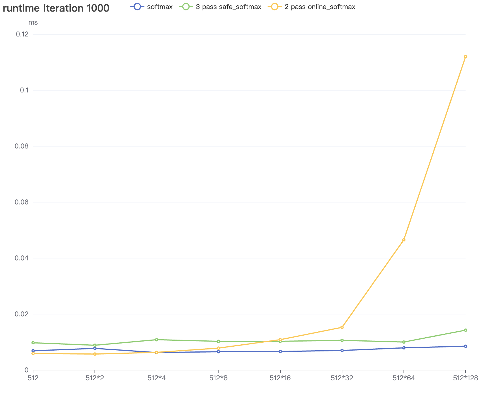

Include

- softmax

- 3 pass safe_softmax

- 2 pass online_softmax

由于算法实现关系, online_softmax_kernel在数据长度增大时复杂度上升明显(因为只用了一个block, 计算强度大但是并行性不行, 当超过512时实际是串行执行)

所有softmax_kernel针对一维向量

测试平台 tesla p4 8G

图中具体数值见[profiling](https://wenqingqian.github.io/assets/html/resource/assets/onlinesoftmax.html)

数学过程见[PDF](https://courses.cs.washington.edu/courses/cse599m/23sp/notes/flashattn.pdf)
或
本人[blog](https://wenqingqian.github.io/assets/pdf/onlinesoftmax.pdf)

